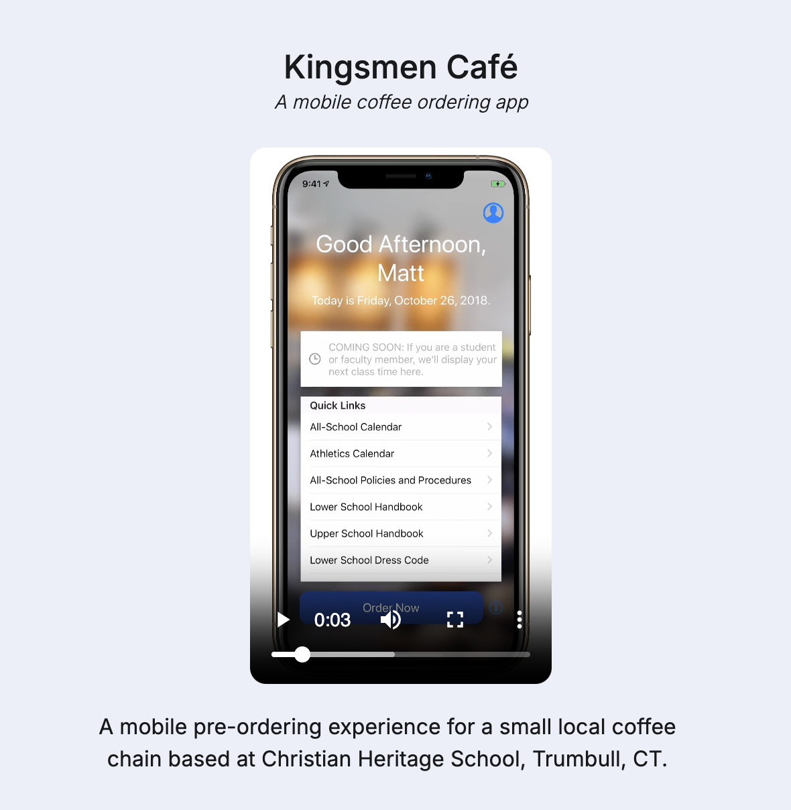

# Kingsmen Café

> Click the image above to see a demo video of the application

This repository hosts a mobile coffee pre-ordering application I developed alongside the Business Acumen class of high school Juniors and Seniors at Christian Heritage School in Trumbull, CT, USA.

It was my first full-stack application for a business-critical use case, a third-party coffee shop that was set up in the library of a small, private K-12 school.

I decided to clean up the original repository a bit and open source it, so that you could see what my mind was thinking about, fresh out of high school in 2017 and 2018, when working on this project.

We got it to 1.0 and had a few updates pushed out before both the business lead and I got too busy with our respective school workloads and abandoned the effort.

The design decisions I made in this project informed my future work, even up till now.

## Features

- Pre-ordering from an entire business-customizable menu of drinks and snacks
- Mobile pre-payment through Square, with support for cardless payment options
- Information hub for the school community, including announcements, dynamic store hours display, and student schedule integration

## Stack

- iOS SDK (Swift)
- Square (eCommerce)
- Node.js (Express)
- MongoDB (Atlas)
- Heroku

## Source Notes

- My version of 'API Versioning' back then manifested in copy/pasting code into separate version folders and having one common entry [`app.js`](./backend/app.js) wrangling the versions. Soon after this I'd had my internship and discovered API Gateways that would alleviate much of this duplication.
- I was already great at ensuring API key secrecy on the backend, using Environment Variables set within Heroku. That was not the case with the iOS App. I have a feeling this comes from the different deployment modalities (Web being on a server, iOS being local and closed source). I have since cleaned up those secrets and ensured my open-sourcing does not reveal any PII.
- You'll also see the iteration of the design of the app, the forward-looking goals of what the app could've looked like, and all the Legal Terms, etc. as well. Huge thanks to my point person on the business side Casey for taking charge of that.
